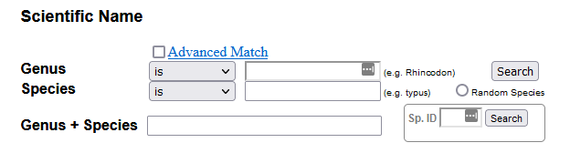

```{css echo=FALSE}
@media print {
  .topicsContainer,
  .topicActions,
  .exerciseActions .skip {
    display: none;
  }
  .topics .tutorialTitle,
  .topics .section.level2,
  .topics .section.level3:not(.hide) {
    display: block;
  }
  .topics {
    width: 100%;
  }
  .tutorial-exercise, .tutorial-question {
    page-break-inside: avoid;
  }
  .section.level3.done h3 {
    padding-left: 0;
    background-image: none;
  }
  .topics .showSkip .exerciseActions::before {
    content: "Topic not yet completed...";
    font-style: italic;
  }
}
```

```{r setup_hide, include=FALSE}
library(learnr)
library(sdmpack)

custom_checker <- function(label, user_code, check_code, envir_result, evaluate_result, envir_prep, last_value, stage, ...) {
  # this is a code check
  if(stage == "check") {
    
    # fofpack::send_env_to_RStudio(envir_prep)
    
    rstudioapi::sendToConsole(user_code, focus = TRUE)
    
    fofpack::set_env(envir_result)
    
    # try(save.image(file.path(system.file(package = "fofpack"), "week_5_progress.Rdata"),
    #            safe = FALSE),
    #     silent = TRUE)

    list(message = "Code Run; Results Now Available in RStudio.", correct = TRUE, type = "success", location = "append")
    
  }

}

tutorial_options(exercise.checker = custom_checker,
                 exercise.timelimit = 300)

knitr::opts_chunk$set(echo = FALSE)
```

## Forests of the Future Week 5 Assignment {data-progressive=TRUE}

### Getting started with Species Distribution Modelling

Species Distribution Modelling is fundamentally an exercise in predicting the occurrence or abundance of a species (or species`) using environmental variables and / or species traits. Collectively these 'predictor' variables are know as features in Machine Learning lingo.

### Setup

```{r setup, include=FALSE}
library(fofpack)
library(tidyverse)
library(tidymodels)

data("RF_abund")

progress <- file.path(system.file(package = "fofpack"), "week_5_progress.Rdata")
if(file.exists(progress)) {
  load(progress, envir = rlang::global_env())
}
```

The following code loads the packages you will need for this assignment, and the dataset you will be using (and clears the workspace). You will be using a dataset on reef fishes from reefs around the world called `RF_abund`. Don't forget to always click 'Run Code' for each code box, which runs your code in RStudio, and allows you to access the results in later code boxes.

```{r do_setup, exercise=TRUE}
rm(list = ls())
library(fofpack)
library(tidyverse)
library(tidymodels)

data("RF_abund")
```

```{r do_setup-check}
ls()
```

Before we do anything else we will transform our abundance variable, because abundance usually has better properties for modelling when it is log-transformed. Note the `+ 1` below deals with values that are zero (log is undefined in this case).

```{r do_setup2, exercise=TRUE}
RF_abund <- RF_abund %>%
  mutate(log_Abundance = log(AbundanceAdult40 + 1))
```

```{r do_setup2-check}
ls()
```


Use the code boxes below each exercise and follow the directions.

## Exercise 1

Make a data.frame with 5 random fish species from `RF_abund`. Just fill in the blank.

```{r e1, exercise=TRUE}
rand_fish <- RF_abund %>%
  select(SpeciesName) %>%
  slice_sample(n = ___)

rand_fish
```

```{r e1-check}
ls()
```

Copy and paste one of the above species names into [Fishbase](https://www.fishbase.se/search.php), using the scientific name section (look for **Genus + Species**), it looks like this:


Have a look at some pictures and get to know your chosen species. You will model this species distribution across different temperatures.

```{r q1}

question_text("What is the common name of your species? (Found under the scientific name on the species page).",
              answer_fn(~ incorrect("Thank you for your answer!")),
              incorrect = "Submitted.",
              allow_retry = TRUE)

```

Put the scientific name in a character object called `mysp`.

```{r e1_2, exercise=TRUE}
mysp <- "___"
```

```{r e1_2-check}
ls()
```

## Exercise 2

First filter the `RF_abund` dataframe to just your chosen species (`mysp`). Call it `mysp_dat`. Fill in the blank. As a reminder, here are the column names of `RF_abund`:

```{r print_cols, echo=TRUE}
names(RF_abund)
```

```{r e2, exercise=TRUE}
mysp_dat <- RF_abund %>%
  filter(___ == mysp)
```

```{r e2-check}
ls()
```

Now plot `MeanTemp_CoralWatch` on the x axis, and `log_Abundance` on the y axis, using `ggplot2`

```{r e2_2, exercise=TRUE}
ggplot(mysp_dat, aes(x = ___, y = ___)) + 
  geom_point() +
  theme_minimal()
```

```{r e2_2-check}
ls()
```

## Exercise 3

Run a linear model to estimate how the species' abundance (`log_Abundance`) responds to mean temperature (`MeanTemp_CoralWatch`). Start by making a formula and assign it to an object called `form`. Then run the model using `tidymodels`, assigning the result to `mysp_mod`. The left hand side is the variable you want to predict (the response). The right hand side the variable you want to use to predict with (the predictor)

```{r e3, exercise=TRUE}
form <- ___ ~ ___

mysp_mod <- linear_reg() %>%
  fit(form,
      data = mysp_dat)

tidy(mysp_mod)
```

```{r e3-check}
ls()
```

Use the above model object to generate predictions for your species at each of the original data points. Assign this to an object called `mysp_preds`

```{r e3_2, exercise=TRUE}
mysp_preds <- 
```

```{r e3_2-check}
ls()
```

```{r e3_2-hint}
predict(mysp_mod, mysp_dat)
```

Run the following code to bind your predictions to the original data:

```{r e3_3, exercise=TRUE}
mysp_dat_preds <- mysp_dat %>%
  bind_cols(mysp_preds)

mysp_dat_preds
```

```{r e3_3-check}
ls()
```

Use the `mysp_dat_pred` to plot the model predictions alongside the observed data. Replace the blank with the correct `ggplot2` code to plot the predictions.

```{r e3_4, exercise=TRUE}
ggplot(mysp_dat_preds, aes(MeanTemp_CoralWatch, log_Abundance)) +
  ___ +
  geom_point() +
  theme_minimal()
```

```{r e3_4-check}
ls()
```

## Just for fun

This section is not for marks, but shows you some more advanced stuff you can do for modelling your species. The section after this has a bonus exercise if you want to try something a bit harder for bonus marks!

The linear model probably didn't fit your species' data very well (but it is possible that it did!). It is usually more effective to model species abundances as a nonlinear function of the environment. There are many advanced machine learning algorithms devoted to complex nonlinear function fitting, but did you know you can model nonlinear relationships with the linear model? It sounds counterintuitive, but it works by creating new synthetic variables, that, when added each in a linear fashion, combine to produce a nonlinear global relationship. This can be achieved in R using the `poly()` function, which creates 'polynomial' variables. For a single variable it produces new variables based on the original variable raised to multiple powers (and then made *'orthogonal'*).

Let's try it! Run the code below to run a 'polynomial' regression on your species:


```{r fun, exercise=TRUE}
form_poly <- log_Abundance ~ poly(MeanTemp_CoralWatch, degree = 3)

mysp_mod_poly <- linear_reg() %>%
  fit(form_poly,
      data = mysp_dat)

tidy(mysp_mod_poly)
```

```{r fun-check}
ls()
```

Now run the following to make a plot of the predictions. Here we predict on a sequence of predictor values to make a smooth prediction line across the full range of predictor values.

```{r fun2, exercise=TRUE}
pred_dat <- tibble(MeanTemp_CoralWatch = seq(min(mysp_dat$MeanTemp_CoralWatch),
                                             max(mysp_dat$MeanTemp_CoralWatch),
                                             length.out = 1000)) %>%
  bind_cols(predict(mysp_mod_poly, .))

ggplot(pred_dat, aes(MeanTemp_CoralWatch, .pred)) +
  geom_point(aes(y = log_Abundance), data = mysp_dat) +
  geom_line() +
  ylim(c(0, NA)) +
  theme_minimal()

## plot just the predictions to see the curve easier:
ggplot(pred_dat, aes(MeanTemp_CoralWatch, .pred)) +
  geom_line() +
  ylim(c(0, NA)) +
  theme_minimal()
```

```{r fun2-check}
ls()
```

How does the fit compare to your original linear model?

## Advanced Bonus Exercise

The following exercise is for those who want to try something more advanced for a bonus 2 marks.
First we run a model with *two* variables instead of one.

```{r b1, exercise=TRUE}
## Note the * means to 'cross' the variables, which means put their individual effects in the model
## plus an 'interaction' between them.
form_2 <- log_Abundance ~ MeanTemp_CoralWatch * Depth_Site

mysp_mod_2 <- linear_reg() %>%
  fit(form_2,
      data = mysp_dat)

tidy(mysp_mod_2)
```

```{r b1-check}
ls()
```

We can plot the original data points for the two predictors, and then plot the third dimension (the response, in this case abundance) using size. The below code does that.

```{r b2, exercise=TRUE}
ggplot(mysp_dat, aes(MeanTemp_CoralWatch, Depth_Site)) +
  geom_point(aes(size = log_Abundance)) +
  scale_size_area() +
  theme_minimal()
```

```{r b2-check}
ls()
```

Now we can make a new dataframe with a 'grid' of predictor values to make prediction on. This uses `cross_df` from `tidyverse` which 'crosses' two vector with each other, making all combinations.

```{r b3, exercise=TRUE}
pred_dat_2 <- cross_df(list(MeanTemp_CoralWatch = seq(min(mysp_dat$MeanTemp_CoralWatch),
                                                      max(mysp_dat$MeanTemp_CoralWatch),
                                                      length.out = 100),
                            Depth_Site = seq(min(mysp_dat$Depth_Site),
                                             max(mysp_dat$Depth_Site),
                                             length.out = 100)))

pred_dat_2
```

```{r b3-check}
ls()
```

Use the `pred_dat_2` dataframe to generate predictions from the model at each predictor grid point and then bind the prediction back to the `pred_dat_2` dataframe. Then use this to plot the predictions along with the data.

```{r b4, exercise=TRUE}


```

```{r b4-check}
ls()
```

<div id="b4-hint">
**Hint:** After binding the predictions back to `pred_dat_2`, for the plot use:
```
ggplot(pred_dat_2, aes(MeanTemp_CoralWatch, Depth_Site)) +
  ___ +
  geom_point(aes(size = log_Abundance), data = mysp_dat) +
  scale_size_area() +
  theme_minimal()
```

Replace the `___` with `geom_contour_filled()` or `geom_tile()`. Look at the documentation to see how they work (or Google them if you prefer). You will have to map the `.pred` variable to an aesthetic within it.
</div>

## Submit

```{r context="server"}
learnrhash::encoder_logic()
```

Once you have completed the assignment to your satisfaction, please click the 'generate' button below. This will create a text code that you can copy and paste into the assignment text submission form on canvas, and which I can use to regenerate your answers. Please make sure you copy the entire code. The easiest way is to click the copy button in at the top right. This will copy the entire code to the clipboard.  


```{r encode, echo=FALSE}
learnrhash::encoder_ui(ui_before = NULL)
```

### Decode

If you want to double-check the answers that the code above stores, paste it here and click 'Decode!'. 

This assignment should have ?? exercises, so you should see ?? chunks of code, each prefixed with exercise_i: (where i is the exercise number).

```{r context="server"}
sdmpack::decoder_logic()
```

```{r decode, echo=FALSE}
sdmpack::decoder_ui()
```

