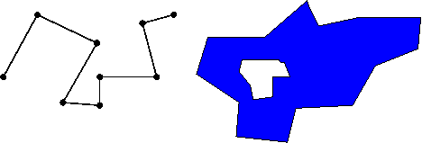

```{css echo=FALSE}
@media print {
  .topicsContainer,
  .topicActions,
  .exerciseActions .skip {
    display: none;
  }
  .topics .tutorialTitle,
  .topics .section.level2,
  .topics .section.level3:not(.hide) {
    display: block;
  }
  .topics {
    width: 100%;
  }
  .tutorial-exercise, .tutorial-question {
    page-break-inside: avoid;
  }
  .section.level3.done h3 {
    padding-left: 0;
    background-image: none;
  }
  .topics .showSkip .exerciseActions::before {
    content: "Topic not yet completed...";
    font-style: italic;
  }
}
```

```{r setup_hide, include=FALSE}
library(learnr)
library(sdmpack)

custom_checker <- function(label, user_code, check_code, envir_result, evaluate_result, envir_prep, last_value, stage, ...) {
  # this is a code check
  if(stage == "check") {
    
    #fofpack::send_env_to_RStudio(envir_prep)
    
    rstudioapi::sendToConsole(user_code, focus = TRUE)
    
    sdmpack::set_env(envir_result)

    list(message = "Code Run; Results Now Available in RStudio.", correct = TRUE, type = "success", location = "append")
    
  }

}

tutorial_options(exercise.checker = custom_checker,
                 exercise.timelimit = 1200)

knitr::opts_chunk$set(echo = FALSE)
```

```{r setup, include=FALSE}
library(sdmpack)
library(tidyverse)
library(sf)
library(stars)

options(datatable.alloccol = 1024,
        datatable.verbose = FALSE)
```

## Spatial Data in R

- Today we will introduce spatial data in R
- Most Species Distribution Modelling is inherently spatial
- We are trying to predict occurrence on a landscape
- To do this effectively we need to deal with spatial data


## Spatial Data

- Spatial data is often classified into two main types
  - Vector Data 
    - Data associated with points, polygons, lines, etc.
  - Raster Data
    - Data arranged in grid cells
- We will use the {sf} package for vector data and the {stars} package for raster data
- Geometrical operations
- Tidy: `sf`, `dplyr` & `ggplot2`

---

```{r setup_ex, exercise=TRUE}
library(sdmpack)
library(tidyverse)
library(sf)
library(stars)
```

```{r setup_ex-check}
ls()
```

## Overview

The following slides have been modified from https://github.com/edzer/rstudio_conf,
authored by Edzer Pebesma (main developer of `sf` and `stars`)

## What makes spatial data challenging? 

> - The Earth is a sphere/spheroid/potato*
> - coordinates consist of two or three numbers that _loose most of their meaning when considered individually_
> - the most common form is Longitude, Latitude (LL) pairs
> - from LL data, `stats::dist` will not give you distances
> - maps and screens are flat, and hence can only show _projected_ data
> - projected distances are distorted, and possibly areas, shapes, directions and shortest paths too
> - the meaning of a LL coordinate depends on the geographic _datum_ (e.g., WGS84, ETRS89, NAD27 etc)
> - a _datum_ is unlikely important when mapping continents, but it is when drones try to deliver pizza's

----

```{r image1, fig.width=500, out.width='65%'}
knitr::include_graphics("https://rdinnager.github.io/sdmpack/images/week_9_lecture_insertimage_1.png")
```

Battersby, S. (2017). Map Projections. The Geographic Information Science & Technology Body of Knowledge (2nd Quarter 2017 Edition), John P. Wilson (ed.). DOI: 10.22224/gistbok/2017.2.7

----

## Simple features

- **feature**: abstraction of real world phenomena (type or instance); has a geometry and other attributes (properties)
- **simple feature**: feature with all geometric attributes described piecewise by straight line or planar interpolation between sets of points (no curves)

- represent geometry by _points_, _lines_ or _polygons_, or _collections_ thereof
- a formal standard (ISO, OGC) since 2004
- supported by OSGeo libraries GEOS and GDAL
- adopted by GeoJSON, GeoSPARQL
- has well-known text (WKT) and binary (WKB) encodings
- WKB used by spatial databases (PostGIS, MariaDB, SQLite, ...)
- standard specifies a number of topological metrics, predicates and operations

## Operations on geometries:

Single:

- logical predicates:  `is_valid`, `is_simple`, `is_empty`
- quantities: `length`, `area`
- `dimension`: 0 = point(s), 1 = linear, 2 = surface
- derived  geometries: `buffer`, `centroid`, `boundary`, `convex_hull`, `simplify`, `linemerge`, `polygonize`, `node`, `point_on_surface`, `triangulate`

Pairs/sets:

- quantities: `distance`
- predicates:  `intersects`, `within`, `contains`, `covers`, `covered_by`, `crosses`, `touches`, `overlaps`, `equals`, `disjoint`, all other DE-9IM 
- new geometries: `intersection`, `difference`, `union`, `sym_difference`

## Package `sf`

> - `sf` stores simple feature geometries **as a list-column** 

> - It does that in `sf` objects, _extending_ `data.frame` **or** `tibble`

> - How does it work?

-------------------


-------------------


-------------------


-------------------


## `sfg` : geometry for one feature


--------
```{r sfc, eval = TRUE, echo = TRUE}
library(sf)
```


## Package `sf` features

- `sf` objects extend `data.frame` or `tbl_df` with a geometry list-column
- fast (C++) WKB $\Longleftrightarrow$ R conversion, used for I/O with libraries and databases
- spatial indexes created on-the-fly to scale up geometrical predicates (intersects) and operations (intersection), and selections (nearest feature)
- simple and relatively small API
- functions/methods start with `st_`, as in 
```{r example,echo=TRUE}
st_is_simple(st_point(0:1))
```

## `sf` & `tidyverse`

- `sf` spatial objects are `data.frame`s (or `tibble`s)
- you can always un-`sf`, and work with `tbl_df` or `data.frame` having an `sfc` list-column
- `sf` methods for `filter`, `arrange`, `distinct`, `group_by`, `ungroup`, `mutate`, `select` have sticky geometry 
- `st_join` joins tables based on a spatial predicate, or user-defined function
-  `summarise` unions geometry by group (or altogether)


## Making an `sf` object from a data.frame is simple

- Use `st_as_sf()`, specify the coordinate columns and a projection (`crs`)

```{r parks_sf, exercise=TRUE}
data(parks_LC)

parks_sf <- st_as_sf(parks_LC, coords = c("long", "lat"), crs = 4326)
parks_sf
```

```{r parks_sf-check}
ls()
```

---

```{r parks_sf2, exercise=TRUE}
data(parks_LC)

parks_sf <- st_as_sf(parks_LC, coords = c("long", "lat"), crs = 4326)
parks_sf
```

```{r parks_sf2-check}
ls()
```

## `sf` object are tibbles (e.g. a data.frame)

```{r filter_sf, exercise=TRUE}
pine_rockland <- parks_sf %>%
  filter(NAME_STATE == "Pine Rockland")
pine_rockland
```

```{r filter_sf-check}
ls()
```

## `geom_sf`

```{r sf_ggplot, exercise = TRUE}
library(ggplot2) 

ggplot(pine_rockland) + 
  geom_sf(aes(colour = prop, size = prop)) +
  theme_minimal()
```

```{r sf_ggplot-check}
ls()
```

## Map Context

The easiest way to view the spatial data in a geographic context is using the package `{mapview}`

```{r sf_mapview, exercise = TRUE}
suppressPackageStartupMessages(library(mapview))
mapview(pine_rockland, cex = "prop")
```

```{r sf_mapview-check}
ls()
```

## sdmpack also includes a polygon for florida

```{r sf_ggplot2, exercise = TRUE}
data(florida)
ggplot(pine_rockland) + 
  geom_sf(data = florida) +
  geom_sf(aes(colour = prop, size = prop)) +
  coord_sf(xlim = st_bbox(pine_rockland)[c(1, 3)],
           ylim = st_bbox(pine_rockland)[c(2, 4)]) +
  theme_minimal()
```

```{r sf_ggplot2-check}
ls()
```

## Quantities

```{r dist, exercise = TRUE}
st_distance(pine_rockland) %>% units::set_units("km")
```

```{r dist-check}
ls()
```

## Raster data, data cubes

- raster data don't fit easily in the simple feature framework: is a raster pixel a point, or a small polygon, or some kind of convolution centered over the pixel center?
- raster data come up often for continuous phenomena, when the "thing"-ness of features doesn't work out (well): is a pixel a thing? is a raster a thing? does the raster contain a thing?
- data (hyper) cubes generalize raster data:
    - multiple layers (time, spectral bands)
    - time _and_ bands (4D)
    - time _and_ bands _and_ sensor (5D)
    - time series for points (e.g. hourly PM10 for a set of sensors)
- data cubes are fashionable but not well defined; watch out for opportunistic definitions.

-------

Data cubes are a more general concept than raster data, e.g.

- number of healthy and ill persons by: region, year, age class
    
## What about gridded / raster data in R?

- package `raster` is powerful, and works well with pipes
- simple features don't scale for raster / imagery data
- (long) time series on features do neither

--------

Package `github.com/r-spatial/stars` for:

- raster and vector data cubes (arrays)
- take on certain raster limitations: 
    - 4D+ rasters (band, time)
    - data sets larger than local disk
- non-raster array data, such as O-D matrix by time and age class
- works with `{sf}`, out of the box

-------

```{r bioclim, exercise=TRUE}
library(stars)
data("bioclim_fl")
data("bioclim_vars")

bioclim_fl
```

```{r bioclim-check}
ls()
```

----

```{r bioclim_plot, exercise=TRUE}
plot(bioclim_fl, join_zlim = FALSE)
```

```{r bioclim_plot-check}
ls()
```

## Extracting data from a `stars` object is simple

```{r extract, exercise=TRUE}
dat_for_parks <- st_extract(bioclim_fl, parks_sf) %>%
  st_as_sf()
dat_for_parks
```

```{r extract-check}
ls()
```

---

Some data is `NA`. Why?

- Some points likely misaligned and fall outside the Florida polygon I used.


```{r inside, exercise=TRUE}
inside <- st_within(parks_sf, florida, sparse = FALSE) 
inside
plot(florida)
plot(parks_sf[!inside, ], col = "red", add = TRUE)
#parks_sf[!inside, ] <- st_snap(parks_sf[!inside, ], st_buffer(florida, -0.001))
```

```{r inside-check}
ls()
```

---

Either need to snap the points into the polygon, get a more detailed polygon, or buffer the polygon to make it slightly larger.

## Why does space matter?

- We want to predict species occurrence on a a landscape to answer the questions:
  - Where is this species? Where was it? Where will it be?
  - So out data needs to be spatial, which means, in general, it has a set of coordinates attached to it locating it somewhere.

- Space also creates non-independence between our data points
  - In other words, space can create spurious correlations
  - Correlation does not imply direct causation
  
## Let's revisit the Reef

```{r RF_abund, exercise=TRUE}
data("RF_abund")
data("RF_sites")
fish_dat <- RF_abund %>%
  filter(SpeciesName == "Thalassoma pavo") %>%
  mutate(Presence = as.factor(Presence))
sites <- st_as_sf(RF_sites, coords = c("SiteLong", "SiteLat"),
                  crs = 4326)

mapview(sites, zcol = "ReefAreaIn15km")
```

```{r RF_abund-check}
ls()
```

## `{spatialsample}`

- A `{tidymodels}` package for 'spatial' cross validation
- Creates training and validation datasets that are spatially disjoint
- This is the method suggested in the 'paintings predict species distributions' paper to increase model evaluation accuracy in the presence of spatial autocorrelation (in other words, always)

---

```{r RF_abund2, exercise=TRUE}
library(spatialsample)

fish_dat <- fish_dat %>%
  left_join(sites %>%
              select(SiteCode)) %>%
  st_sf()

mapview(fish_dat, zcol = "MeanTemp_CoralWatch")
```

```{r RF_abund2-check}
ls()
```

---

```{r RF_abund3, exercise=TRUE}
data_split <- spatial_block_cv(fish_dat, buffer = 200000)
autoplot(data_split)
autoplot(data_split$splits[[1]])
autoplot(data_split$splits[[2]])
```

```{r RF_abund3-check}
ls()
```

## Next Class

- We will run some `{tidymodels}` models with `{spatialsample}`
- Learn how to use Global Biodiversity Information Facility (GBIF) to get occurrence data
- Choose a species to start collecting data for (possibly for final project?)

---

## Sign up for GBIF before next class

- Go to https://www.gbif.org/
- Click 'login' in upper right corner
- Click on 'Register' tab
- Fill in the form, or login with Google, Facebook, or Github

## Next Week

- Look at a method to remove spatial autocorrelation
- Find out how to make a model when you only have presences and no absences
- Extract data for point using `{tidysdm}`
- Talk about Final Projects 

