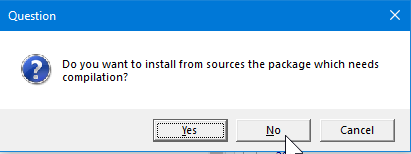
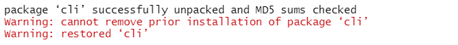
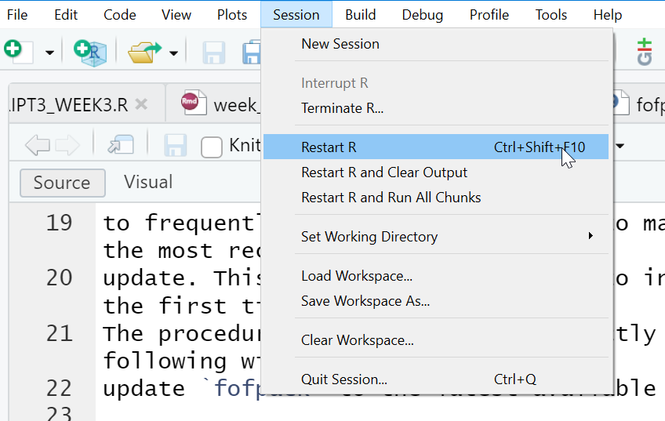
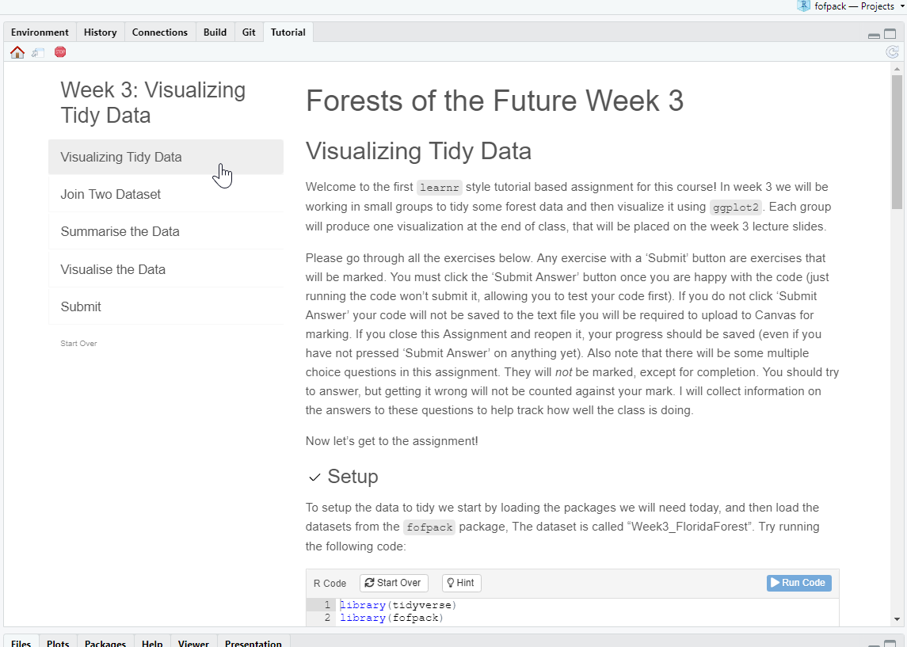
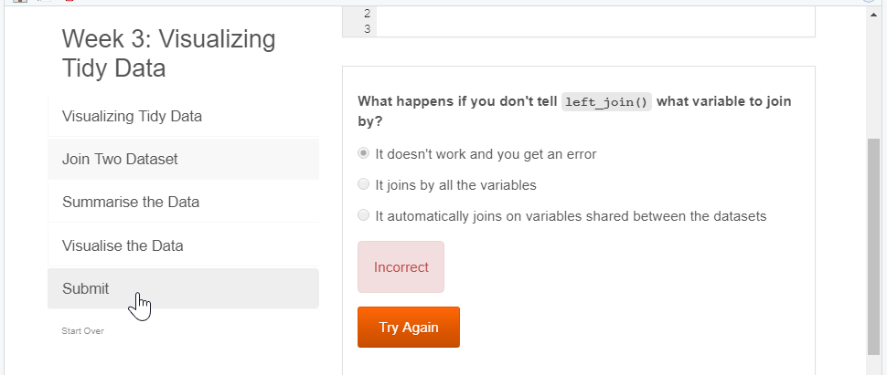
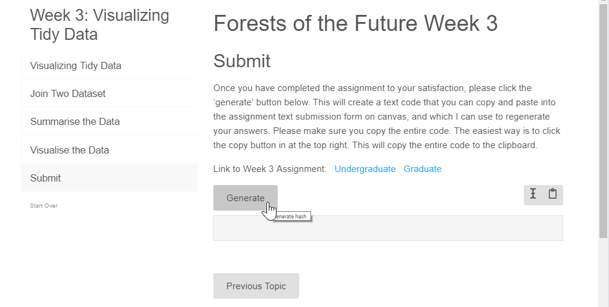
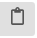
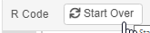

```{r, include = FALSE}
knitr::opts_chunk$set(
  collapse = TRUE,
  comment = "#>"
)
```

## Installing `sdmpack`

The `sdmpack` package includes all data and assignments necessary for the 
course Forests of the Future. It is regularly updated so it will be necessary
to frequently reinstall the package to make sure you have all the most recent
update. This document shows you how to install `sdmpack` for the first time. 
The procedure to *re*-install is exactly the same. Doing the following will
update `sdmpack` to the latest available version.

The first thing you need is to make sure that the R package `devtools` is 
installed. 

```{r install_devtools}
if(!require(devtools)) {
  install.packages("devtools")
}
```

Once `devtools` is installed, then you can run the following:

```{r install_sdmpack}
library(devtools)
install_github("rdinnager/sdmpack", dependencies = TRUE, upgrade = TRUE)
```

Note that if `devtools` has not been installed properly then `library(devtools)`
will fail with an error. If this is the case, try installing `devtools` again.
`dependencies = TRUE` and `upgrade = TRUE` should force the installation or
upgrading of any package dependencies of `sdmpack`, so you should not have to
install dependencies manually. The output of the above command will depend
on what package you have installed already.

When you run the above code you might get a dialog box like this:

You will need to make a choice before installation will proceed. I recommend choosing 'No', since you should not need to install from source most of the time (this just means the package is 'compiled' on your computer instead of simply downloading a 'precompiled' package.)

During installation you might get a warning like this:



In most cases this can be ignored because the package was restored from the old version. To get rid of this warning, you musr clear your workspace and then restart R. The above issue happens if the package was in use when R tried to reinstall it. It generally only happens on Windows.

To test if `sdmpack` has been installed properly, run `library(sdmpack)`, and
make sure you get no errors. 

**###Important**: To make sure `sdmpack` has successfully been updated to the latest version run:

```{r check_version}
library(sdmpack)
sdmpack_up_to_date()
```

If your `sdmpack` is not up to date this function will warn you and provide instructions on how up date.

Once `sdmpack` is installed, assignments should appear in the 'Tutorial' pane of RStudio, where they will be prefixed by the week (e.g. Week 3: Visualising Tidy Data). If they do not appear, try restarting R by clicking 'Session', then 'Restart R' from the RStudio menu:



## Doing Assignments

### Assignment in the 'Tutorial' Pane:


Click on the 'Start Tutorial' button to render and load the assignment. If for
some reason the assignment is still not showing up in the 'Tutorial' pane, even
after restarting R, you can run the assignment by typing 
`learnr::run_tutorial("week_?", "sdmpack")` in the R console, replacing `?` with
week number for the desired assignment (e.g. `learnr::run_tutorial("week_3", "sdmpack")`). 
It should look something like this:



Go through the assignment, following the instructions. Code boxes with
a 'Submit Answer' box are required to be completed for full marks.
Note that the 'Submit Answer' button currently does not do anything other
than run the code in the box. 


## Submitting Your Work

To actually submit your answers you use the 'Submit' section of the assignment. 
Click on the 'Submit' section on the left hand navigation bar for the assignment



It should look like this:



Click on the 'Generate' button when you are ready to submit (e.g. you have filled
in all of the required code boxes and answered the questions). This will generate
a text code like this:


This is called a 'hash' code, and your answers are encrypted within it. I can retrieve
your answers from this code once you submit it on Canvas. Next, click the 'Copy hash to clipboard'  button to copy the hash code. This is what you will paste into the assignment on Canvas. On Canvas paste the copied hash code into the assignment text box:


Please do not add any additional text in the text box or it will corrupt the
hash code and I won't be able to retrieve your answers. If you need to add any
additional information please use the 'comment' field.


## Saving Your Work

Progress on your assignment should be saved automatically so that if you close 
it then reopen it, you should not lose anything. On the left side of the assignment
is a small 'Start Over' button. Be careful! If you click this the assignment will
be reset and you will lose all of your work! Individual exercises can also be reset
using the 'Start Over' button in the code box:


