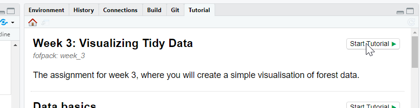

```{r, include = FALSE}
knitr::opts_chunk$set(
  collapse = TRUE,
  comment = "#>"
)
```

## Installing `sdmpack`

The `sdmpack` package includes all data and assignments necessary for the 
course Forests of the Future. It is regularly updated so it will be necessary
to frequently reinstall the package to make sure you have all the most recent
update. This document shows you how to install `sdmpack` for the first time. 
The procedure to *re*-install is exactly the same. Doing the following will
update `sdmpack` to the latest available version.

The first thing you need is to make sure that the R package `devtools` is 
installed. 

```{r install_devtools}
if(!require(devtools)) {
  install.packages("devtools")
}
```

Once `devtools` is installed, then you can run the following:

```{r install_sdmpack, eval=FALSE}
library(devtools)
install_github("rdinnager/sdmpack")
```

Note that if `devtools` has not been installed properly then `library(devtools)`
will fail with an error. If this is the case, try installing `devtools` again.

When you run the above code you might get a dialog box like this:

You will need to make a choice before installation will proceed. I recommend choosing 'No', since you should not need to install from source most of the time (this just means the package is 'compiled' on your computer instead of simply downloading a 'precompiled' package.)

During installation you might get a warning like this:


In most cases this can be ignored because the package was restored from the old version. To get rid of this warning, you musr clear your workspace and then restart R. The above issue happens if the package was in use when R tried to reinstall it. It generally only happens on Windows.

If installation from github fails for any reason you can try installing using the R-Universe instead by running this code:

```{r install_univers, eval=FALSE}
install.packages('sdmpack', repos = c('https://rdinnager.r-universe.dev', 'https://cloud.r-project.org'))
```

To test if `sdmpack` has been installed properly, run `library(sdmpack)`, and
make sure you get no errors. 

Once `sdmpack` is installed, assignments should appear in the 'Tutorial' pane of RStudio, where they will be prefixed by the week (e.g. Week 3: Visualising Tidy Data). If they do not appear, try restarting R by clicking 'Session', then 'Restart R' from the RStudio menu:


If the assignment does not appear in the 'Tutorial' pane, or if you would prefer,

## Doing Assignments

### Assignment in the 'Tutorial' Pane:




Click on the 'Start Tutorial' button to render and load the assignment. If for
some reason the assignment is still not showing up in the 'Tutorial' pane, even
after restarting R, you can run the assignment by downloading the assignment from the course's canvas website (I post all assignments there), where they will have '.Rmd' as their file extension. You can open this file in RStudio and then click the 'Run Document' button. Once you have done that, it should look something like this:


Go through the assignment, following the instructions. Answer any questions (which will be marked by italicized text of the form 'question_{number}'), run the code in code boxes and complete any exercise code boxes. Exercise code boxes that must be completed for full marks are marked with italicized text of the form 'exercise_{number}', and look like this: 


Clicking 'Test Code' will run the code in a local environment within the code tutorial. Clicking 'Run Code' will run the code locally but also send it to RStudio so you can access the object it creates in the environment browser, and also so you can build results across multiple code boxes. You must click either 'Test Code' or 'Run Code' in order for your answer to be recorded.

## Submitting Your Work

To actually submit your answers you use the 'Submit' section of the assignment. 
Click on the 'Submit' section on the left hand navigation bar for the assignment


It should look like this:


Click on the 'Generate' button when you are ready to submit (e.g. you have filled
in all of the required code boxes and answered the questions). This will generate
a text code like this:


This is called a 'hash' code, and your answers are encrypted within it. I can retrieve
your answers from this code once you submit it on Canvas. Next, click the 'Copy hash to clipboard'  button to copy the hash code. This is what you will paste into the assignment on Canvas. On Canvas paste the copied hash code into the assignment text box:


Please do not add any additional text in the text box or it will corrupt the
hash code and I won't be able to retrieve your answers. If you need to add any
additional information please use the 'comment' field.

If you want to double-check the hash code has stored your answers correctly before submitting it on Canvas, each assignment now has a 'Decode' section that looks like this:


Just paste the hash code into the box and click 'Decode!':


In the Submission box it should show the answers you put in the exercise code boxes (and answers to any questions). If you did not fill out an exercise or forgot to test or run the code, then there will be no entry for that exercise. If there is any missing exercises go back to the tutorial code box and make sure you have completed it and clicked 'Test Code' or 'Run Code'. Then come back to the Submit section. Make sure you click 'Generate' again to regenerate a code with whatever new changes you made.

## Saving Your Work

Progress on your assignment should be saved automatically so that if you close 
it then reopen it, you should not lose anything. On the left side of the assignment
is a small 'Start Over' button. Be careful! If you click this the assignment will
be reset and you will lose all of your work! Individual exercises can also be reset
using the 'Start Over' button in the code box:


Again, if you click this, your previous answer will be lost, so be careful.
